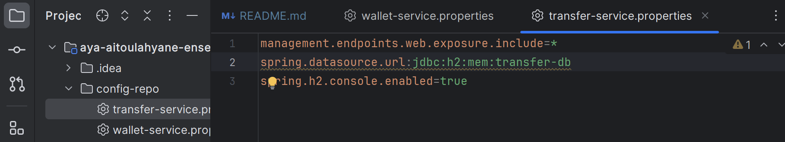

# Évaluation Architectures Micro-services

> Réalisé par : **Aitoulahyane Aya** [`Linkedin`](https://www.linkedin.com/in/aya-aitoulahyane/)
> Date : Lundi 30 Octobre 2021
> Configuration du projet :
> - Version : Java 17
> - Maven : 2.7.17
>


## Notes importantes 
- Pour des raison de simplicité, nous allons utiliser la base de données H2 pour stocker les données de nos micro-services.
- Pour des raison de simplicité, les fichiers de configuration seront stockés en local
- Discovery service : Consul

## Les micro-services 

Voici une brouillon de schéma que nous allons adopté pour cette architecture :


Notez bien que chaque service fonctionnels doit contenir AU MOINS:
- Les entités
- Les repositories
- Les DTOs (pour le mapping)

### 1. Dependencies
Pour le discovery service, on lance consul en local sur le port 8500
```shell
.\consul agent -server -bootstrap-expect=1 -data-dir=consul-data -ui -bind='192.168.159.41'
```
Note : L'adresse IP est celle de mon réseau local, vous pouvez la changer par la votre.


On teste sur l'adresse [http://localhost:8500/ui](http://localhost:8500/ui)


Pour les autres micro-services, on ajoute les dépendances suivantes avec Spring Initializr :

| Service          | Dependencies                                                                                             |
|------------------|----------------------------------------------------------------------------------------------------------|
| Config-service   | Config server - Actuator - Consul Discovery                                                              |
| Wallet-service   | Config client - Actuator - Consul Discovery- JPA-Web-H2-Lombok- Rest Repositories                        |
| Transfer-service | Config client - Actuator - Consul Discovery- JPA-Web-H2-Lombok- Rest Repositories - Open Feign - HATEOAS |
| Gateway-service  | Gateway - actuator - Consul Discovery                                                                    |

- Transfer Service nécessite les dépendances Open Feign et HATEOAS car elle devrait communiquer avec le service wallet service.

### 2. Configuration application.properties

Pour chaque micro-service, on définira les propriétés suivantes :

| Service          | Port | spring.application.name | spring.config.import |
|------------------|------|-------------------------|----------------------|
| Config-service   | 8888 | config-service          |                      |
| Wallet-service   | 8081 | wallet-service          | configserver         |
| Transfer-service | 8082 | transfer-service        | configserver         |
| Gateway-service  | 8080 | gateway-service         |                      |

- Pour configurer le config-service, on ajoute la ligne suivante dans le fichier application.properties :
```application.properties
spring.cloud.config.server.git.uri=file:///C://Users//aitay//Documents//Github//traitement-parallele-big-data//aya-aitoulahyane-enset-adria-test//config-repo
```

Ce config-repo contient les fichiers de configuration de chaque micro-service.



- Pour configurer les autres micro-services, on ajoute la ligne suivante dans le fichier application.properties (exemple wallet service) :
```application.properties
spring.port=8081
spring.application.name=wallet-service
spring.config.import=optional:configserver:http://localhost:8081
```

On test en démarant les services, si tout fonctionne bien les services s'affichent sur la console de consul.


### 3. Les services fonctionnels

#### 3.1. Wallet Service

##### 3.1.1. Les entités

- [`Wallet.java`](wallet-service/src/main/java/com/example/walletservice/entities/Wallet.java)
- [`Client.java`](wallet-service/src/main/java/com/example/walletservice/entities/Client.java)

##### 3.1.2. Les repositories
- [`WalletRepository.java`](wallet-service/src/main/java/com/example/walletservice/reps/WalletRepository.java)
- [`ClientRepository.java`](wallet-service/src/main/java/com/example/walletservice/reps/ClientRepository.java)


